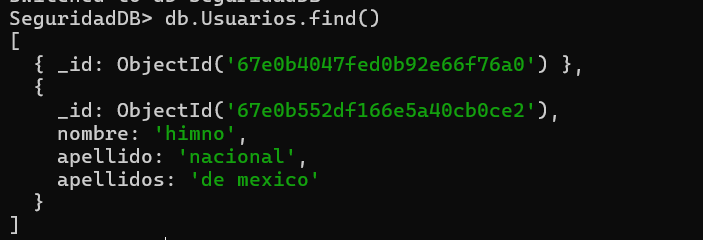
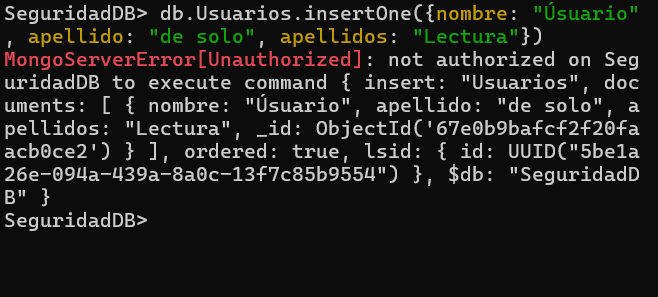
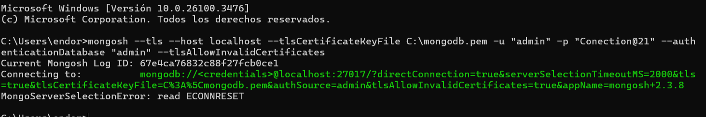

# Seguridad MongoDB

Requisitos previos antes de ininciar -> Tener OpenSSL instalado en tu sistema operativo.
## Instalación de OpenSSL
Se instalo desde -> https://slproweb.com/products/Win32OpenSSL.html

Durante la instalación, asegúrarnos de seleccionar la opción "The OpenSSL binaries (/bin) directory" para agregar OpenSSL al PATH del sistema.

Pero en mi caso no se agrego al path asi que se lo agremamos manualmente.


# 1. Abilitar la autenticación en MongoDB

### Agrega o modifica la siguiente configuración en la sección security:

security:    
authorization: enabled


### Guardar los cambios y reiniciar el servicio de MongoDB.


# 2. Crear Usuarios con Roles y Permisos Específicos

Ya tengo creado un usuario admin


### Crear un usuario con permisos de solo lectura

Movernos a la base de datos que deseamos proteger. Por ejemplo, usemos la base de datos "SeguridadDB".


**Creación**:


**Verificar su autorización:**


**Prueba de lectura:** 



**Prueba de escritura:**


----------------------------------------------------------------------
### Crear un usuario con permisos de lectura y escritura


**Ingresar**


**Prueba de lectura:**


**Prueba de Escritura**


# 3. Configurar Conexiones Seguras con SSL/TLS

### Generar Certificados SSL/TLS


### Combina las claves en un solo archivo:


## Configurar MongoDB para usar SSL

**Abrir mongod.cfg y agrega/modifica:**


**Reinicia MongoDB para aplicar los cambios:**


**Aqui me ocurrio un error al reiniciar MongoDB:**

---

### **Error con TLS**
MongoDB no iniciaba debido a dos factores principales:

1. **Falta de cadena de confianza**: MongoDB requiere un archivo CA (`mongodb-ca.pem`) para validar el certificado público (`mongodb.pem`). Sin esta cadena de confianza, MongoDB no puede garantizar la seguridad de las conexiones y por eso no inicia.

2. **Configuración TLS**: MongoDB utiliza como protocolo estándar para conexiones seguras. Cualquier intento de usar configuraciones antiguas relacionadas con **SSL** no es compatible, ya que SSL está obsoleto.

---

### **Cómo se solucionó**
1. **Generación del archivo CA**: Usamos OpenSSL para crear un archivo CA autofirmado (`mongodb-ca.pem`):
   ```bash
   openssl req -new -x509 -days 365 -key C:\mongodb-key.pem -out C:\mongodb-ca.pem
   ```

2. **Actualización del archivo de configuración**: Se ajustó el archivo `mongod.cfg` para incluir los archivos necesarios:

  

3. **Reinicio y prueba**: Una vez configurado correctamente, MongoDB se reinició y aceptó conexiones seguras utilizando TLS.

---
Pero ahunque si puedo reiniciar el archivo de configuración ahun asi no me deja iniciar sesion
  
